Hi, I'm [Abdulrahman Agiba | t40ix](https://t40ix.vercel.app/) — a 3rd-year IT student at the Faculty of Computers and Information @ [Tanta University](https://ci.tanta.edu.eg/en/) , currently getting into cloud computing , specifically cloud security.

## About Me

Alongside that , I build things — Linux tools and Obsidian plugins. I run a minimal EndeavourOS setup and spend a lot of time in dotfiles and system internals.

I'm part of the [Hidden Lock Team](https://www.hiddenlockteam.com/), where I help the Arab Linux community [troubleshoot issues](https://www.hiddenlockteam.com/p/issues-linux-hidden-lock-team-root-bg.html).

## Featured Project

### [StoneGate for Obsidian](https://github.com/xsiphr/StoneGate-plugin)
*A secure lock screen and vault protection plugin.*

Officially published in the [Obsidian Community Store](https://community.obsidian.md/plugins/stonegate). StoneGate protects your Obsidian vault and specific folders with password authentication, automatic idle timeouts, brute-force lockouts, and a stealth mode for hiding protected folders. 

  

### [Oxiv](https://github.com/xsiphr/Oxiv)
*A minimal, watermark-free social media extractor.*

Open-source, stateless media extractor with zero-retention architecture. Live at [oxivapp.vercel.app](https://oxivapp.vercel.app). Currently supports TikTok and Pinterest with watermark-free downloads, direct MP4/MP3 extraction, and client-side ZIP bundling.

   

## Stack

## Stats

  

   

 

  <h3>Profile Views: </h3>

 

  <!-- Contribution Snake Animation -->
  <picture>
    <source media="(prefers-color-scheme: dark)" srcset="https://raw.githubusercontent.com/xsiphr/xsiphr/output/github-contribution-grid-snake-dark.svg">
    <source media="(prefers-color-scheme: light)" srcset="https://raw.githubusercontent.com/xsiphr/xsiphr/output/github-contribution-grid-snake.svg">
    
  </picture>

## Get in Touch

[<picture><source media='(prefers-color-scheme: dark)' srcset='https://api.iconify.design/simple-icons/vercel.svg?color=white&height=30'><source media='(prefers-color-scheme: light)' srcset='https://api.iconify.design/simple-icons/vercel.svg?color=black&height=30'></picture>](https://xsiporto.vercel.app/)&nbsp; &nbsp;
[<picture><source media='(prefers-color-scheme: dark)' srcset='https://api.iconify.design/simple-icons/protonmail.svg?color=white&height=30'><source media='(prefers-color-scheme: light)' srcset='https://api.iconify.design/simple-icons/protonmail.svg?color=black&height=30'></picture>](mailto:xsiphr@proton.me)&nbsp; &nbsp;
[<picture><source media='(prefers-color-scheme: dark)' srcset='https://api.iconify.design/simple-icons/linkedin.svg?color=white&height=30'><source media='(prefers-color-scheme: light)' srcset='https://api.iconify.design/simple-icons/linkedin.svg?color=black&height=30'></picture>](https://www.linkedin.com/in/abdulrahman-agiba/)&nbsp; &nbsp;
[<picture><source media='(prefers-color-scheme: dark)' srcset='https://api.iconify.design/simple-icons/x.svg?color=white&height=30'><source media='(prefers-color-scheme: light)' srcset='https://api.iconify.design/simple-icons/x.svg?color=black&height=30'></picture>](https://x.com/0xsiphr)&nbsp; &nbsp;
[<picture><source media='(prefers-color-scheme: dark)' srcset='https://api.iconify.design/simple-icons/telegram.svg?color=white&height=30'><source media='(prefers-color-scheme: light)' srcset='https://api.iconify.design/simple-icons/telegram.svg?color=black&height=30'></picture>](https://t.me/xsiphr)
